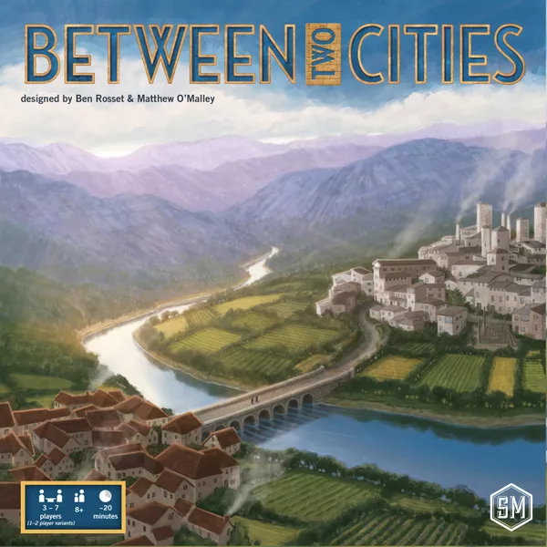

# Between Two Cities

| [BGG page](https://boardgamegeek.com/boardgame/168435/between-two-cities)
|
[mod.io site](https://mod.io/g/tabletopplayground/m/between-two-cities?portal=steam&login=auto)
|

> It is the early 1800s, a time of immense construction and urbanization. You are a world-renowned master city planner who has been asked to redesign two different cities. Projects of such significance require the expertise of more than one person, so for each assignment you are paired with a partner with whom to discuss and execute your grandiose plans. Will your planning and collaborative skills be enough to design the most impressive city in the world?

Between Two Cities is a partnership-driven tile-drafting game in which each tile represents part of a city: factory, shop, park, landmarks, etc. You work with the player on your left to design the heart of one city, and with the player on your right to design the heart of another city. On each turn you select two tiles from hand, reveal them, then work with your partners separately to place one of those tiles into each of your two cities before passing the remaining hand of tiles around the table.

At the end of the game, each city is scored for its livability. Your final score is the lower of the livability scores of the two cities you helped design. To win, you have to share your attention and your devotion between two cities. The player with the highest final score wins the game.

The game features play for 3-7 players in 20-25 minutes

# About this mod

This mod is ready to play in TTPG with
- Ruleset in english
- Snap points in the points board and the player boards
- Table setup for 3 to 5 players (missing 6 and 7 players!)
- Shuffle the decks on a new instance of the game

Do you have suggestions or issues? check the monorepo: 

https://github.com/AucaCoyan/tabletop-playground-mods
